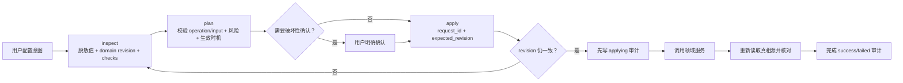

# Nexus 对话配置控制面

## 目标

Nexus 的配置真相源并不只是一份 JSON：Provider、Agent、Channel、Connector、Automation 等状态在数据库中，用户偏好和 WebSearch 凭据在用户配置目录，主机启动参数来自环境变量，桌面 workspace 设置来自 `runtime-settings.json`。因此，“像 Hermes 一样通过对话配置一切”不能等价成让智能体随意读写文件或执行 SQL。

本控制面把这些异构真相源投影成一棵可发现、可脱敏读取、可预检、可审计的虚拟配置树。写入仍交给现有领域服务执行，确保 Web UI 与对话入口共享验证、级联、加密和 runtime reconcile 规则。

## 稳定写入协议

这个协议解决四类对话自动化常见故障：

- `expected_revision` 阻止智能体用旧上下文覆盖刚发生的新配置。
- `request_id` 是唯一幂等键；网络重试只重放结果，不会重复创建或删除。
- `confirm=true` 只对目录中标记为破坏性的操作有效，且必须先向用户展示 plan 影响。
- 审计在领域写入前创建为 `applying`，因此不会出现“变更已发生但完全没有追踪记录”的静默路径。

## 配置域与真相源

| Domain | 真相源 | 通用写入 | Runtime 生效 |
|---|---|---:|---|
| `preferences` | 用户 preferences JSON + 独立 WebSearch 凭据 | `update` | WebSearch 立即同步，失败回滚 |
| `providers` | 数据库 | CRUD、模型发现/更新/默认/测试 | 下一轮或立即 |
| `agents` | 数据库 + 派生 workspace settings | create/update/delete | 下一会话；删除立即 |
| `channels` | 数据库 + 加密凭据 | 配置、账号、配对 | 热重载 |
| `connectors` | 数据库 + 加密凭据 | 直连、断开、OAuth client | 下一会话 |
| `skills` | 数据库 + 用户 Skill 库 | 来源、安装、卸载、更新、删除 | 立即或下一会话 |
| `host` | 环境变量 + `runtime-settings.json` | 仅 workspace runtime setting | 重启 |
| `automation` | 数据库 + scheduler runtime | 委托 `nexus_automation` | 专用工具核对 |
| `rooms` | 数据库 + Room runtime | 委托 `nexus_room` / `nexus-manager` | 专用工具核对 |
| `workspaces` | workspace 文件系统 | 委托 `nexus-manager` | 立即 |
| `goals` | 数据库 + Goal runtime | 委托 `nexus_goal` | 专用工具核对 |

环境变量属于部署控制面。智能体可以读取脱敏状态和解释修改方法，但不能把一次文件写入伪装成已经改变当前进程；当前仅桌面 `workspace_path` 有受控持久化入口，并明确返回 `restart_required`。

## 权限与秘密

- `nexus_config` 只注入主智能体，服务层仍会再次验证 `IsMainAgent`、owner 和 agent 身份。
- owner/agent/session 身份来自服务端 runtime 上下文，不接受模型参数覆盖。
- 普通 Agent 看不到全局配置工具，不能枚举 Provider、Channel、Connector 或其他 Agent 配置。
- 工具结果、revision 输入、审计 request/result 共用一个递归脱敏入口。
- token、secret、password、API key、认证 header、数据库 URL 和内部 system prompt 只暴露 `configured` 状态。
- Channel 和 Connector 凭据继续使用既有加密仓储；Provider token 与自定义 Agent MCP 配置沿用当前存储模型，但永不经控制面读取或审计回显。后续若迁移底层加密，不改变本协议。

## 工具

- `inspect_nexus_configuration`：发现域、读取脱敏状态、获取 revision、执行本地确定性检查。
- `plan_nexus_configuration_change`：验证 exact operation/target/input，返回风险、确认要求和 runtime effect。
- `apply_nexus_configuration_change`：执行幂等、乐观并发保护的写入，并返回写后 revision/checks。
- `list_nexus_configuration_changes`：查询 owner 隔离的脱敏审计和执行状态。

Provider 的远端连通性检查可能产生费用或外部流量，因此普通 `verify=true` 不发网络请求；必须显式 plan/apply `test_provider` 或 `test_model`。Automation、Room、Workspace 和 Goal 已有更强的专用上下文、权限与生命周期工具，统一配置目录只负责发现和明确委托边界。

`inspect` 返回的每个 operation 都带 `target_description`、`input_shape` 和 `required_input_fields`，它们是对话时的实时契约。更新输入采用 merge-patch 语义：未提供的 Provider 字段、Agent options 和嵌套 Preferences 保持原值；显式数组替换数组，显式 `null` 清除可清除字段。服务端拒绝未知字段，避免拼写错误被静默忽略。

## 已知存储边界

对话控制面解决的是安全操作协议，不会自动把历史数据存储重构为统一 JSON。底层仍需继续推进两项独立工作：

1. Provider `auth_token` 与 Agent `mcp_servers` 中的用户秘密迁移到统一加密 Secret Store。
2. 对需要强回滚的非破坏性域增加 revision snapshot；秘密变更和外部 OAuth/Channel 连接不应提供伪安全的一键回滚，而应重新授权或显式重配。

这两项不会阻塞当前稳定修改：控制面已经阻止秘密回显、旧版本覆盖、重复执行、越权写入和无审计写入。
