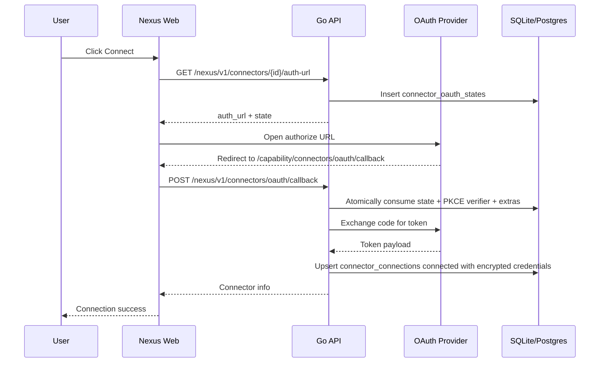
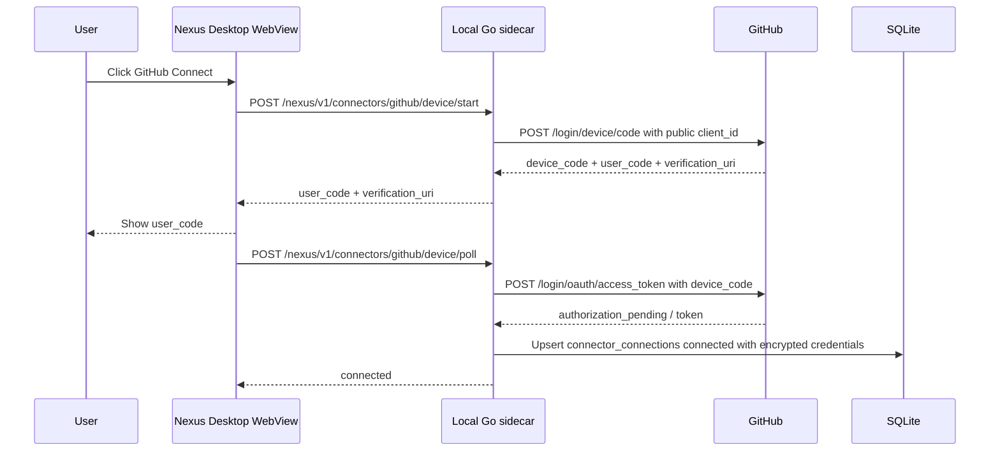
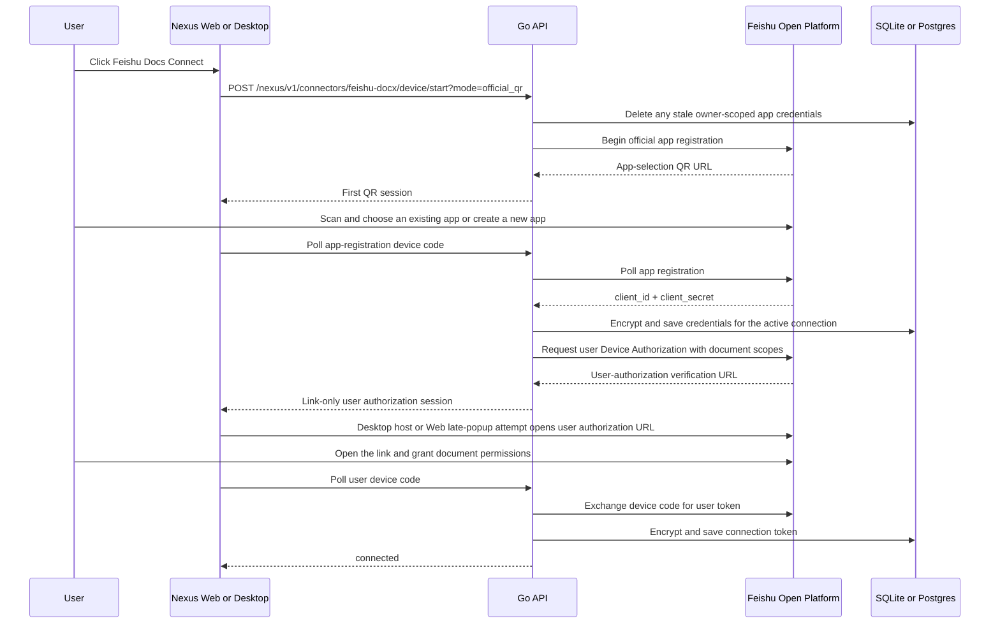

# Connector OAuth Spec

## Flow

### Web authorization code



### Desktop GitHub Device Flow



### Feishu Docs QR bootstrap and Device Flow



Every Feishu Docs connection starts from an explicit choice. The primary path is the official application QR page, where the user can choose an existing application or create a new one. Manually entering App ID / App Secret is a visible fallback when that QR path is unavailable; it proceeds directly to user authorization. The subsequent user Device Authorization URL is opened directly rather than re-encoded as a QR code: live desktop verification showed that the re-encoded link remains pending when opened through Feishu's built-in scanner, while directly opening the same URL completes the grant. Neither surface opens an extra window during application selection. Once Feishu returns the App ID and secret, the desktop host opens the user-authorization link through its native bridge and Web attempts to open it in a compact resizable window. That window synchronously renders a lightweight Nexus loading surface before navigating to Feishu so provider latency never appears as an oversized blank page. Because browsers may block a popup created after the asynchronous QR poll, Web keeps the Nexus page in place and turns the fallback into an explicit primary action instead of opening an early waiting window. Nexus keeps the selected credentials only while they are required by the active OAuth connection and token refresh. Disconnecting, cancelling, or reaching a terminal authorization failure clears both the user token and owner-scoped app credentials, so a later connection never silently reuses a fixed App ID.

## Provider Matrix

| Provider | Authorize URL | Token URL | Scopes | PKCE | Token auth | Extras |
| --- | --- | --- | --- | --- | --- | --- |
| GitHub | `https://github.com/login/oauth/authorize` / desktop `https://github.com/login/device/code` | `https://github.com/login/oauth/access_token` | `repo read:user user:email` | No | web form `client_secret`; desktop Device Flow uses public `client_id` only | none |
| Feishu Docs | official app-registration QR / `https://accounts.feishu.cn/oauth/v1/device_authorization` | `https://open.feishu.cn/open-apis/authen/v2/oauth/token` | Docx, Drive, Wiki, Sheets, Bitable, Search, `offline_access` | No | selected or newly created confidential client; user Device Flow | application QR followed by direct user-authorization link |
| Gmail | `https://accounts.google.com/o/oauth2/v2/auth` | `https://oauth2.googleapis.com/token` | `https://www.googleapis.com/auth/gmail.modify` | Yes | form `client_secret` | none |
| LinkedIn | `https://www.linkedin.com/oauth/v2/authorization` | `https://www.linkedin.com/oauth/v2/accessToken` | `openid profile email` | Yes | form `client_secret` | none |
| X / Twitter | `https://twitter.com/i/oauth2/authorize` | `https://api.twitter.com/2/oauth2/token` | `tweet.read users.read offline.access` | Yes | HTTP Basic Auth | none |
| Instagram | `https://www.instagram.com/oauth/authorize` | `https://api.instagram.com/oauth/access_token` | `instagram_business_basic` | No | form `client_secret` | none |
| Shopify | `https://{shop}.myshopify.com/admin/oauth/authorize` | `https://{shop}.myshopify.com/admin/oauth/access_token` | `read_products read_orders read_customers` | No | form `client_secret` | `shop` |

## Authentication Simplification Audit (2026-07-28)

The audit covers every released channel and connector in the current catalog. A
credential flow is replaced only when the platform publishes an official
provisioning or Device Authorization protocol; Nexus does not trade away account
security for an unofficial token broker.

| Surface | Simplest verified official flow | Nexus behavior |
| --- | --- | --- |
| Feishu IM | QR app registration can select an existing app or create a new one | QR-first or manual App ID / App Secret; both paths are supported |
| DingTalk IM | QR robot creation returns app credentials | QR-first; manual AppKey / AppSecret is recovery-only |
| WeCom IM | QR intelligent-robot creation returns bot credentials | QR-first; manual Bot ID / Secret is recovery-only |
| Personal Weixin IM | QR login | Existing QR flow retained |
| Feishu Docs | QR-select an existing app or create one, then OAuth Device Authorization | Official QR is the primary path on every connection; manual App ID / App Secret is fallback-only |
| GitHub desktop | OAuth Device Flow | QR/device flow; a deployment-level public Client ID is still required |
| GitHub web, Gmail, LinkedIn, X, Instagram, Shopify | Standard browser OAuth | Users click Connect and do not enter tokens, but deployment OAuth client credentials remain required |
| Telegram, Discord | Bot portal creation with bot token; Discord also requires Application ID | Existing manual fields retained; no official automatic app-provisioning flow was verified |
| AMap, Didi, DingTalk AI Table, Tencent Docs, Yuque | Platform-issued API key or token | Existing credential field retained; no official QR or no-credential replacement was verified |

Primary implementation references reviewed for the QR replacements:

- Feishu Node SDK `registerApp`: <https://github.com/larksuite/node-sdk>
- DingTalk official connector quick setup: <https://www.npmjs.com/package/@dingtalk-real-ai/dingtalk-connector>
- WeCom official OpenClaw plugin: <https://github.com/WecomTeam/wecom-openclaw-plugin>
- Didi official MCP API (key remains required): <https://mcp.didichuxing.com/api>
- Yuque official MCP server (`YUQUE_TOKEN` remains required): <https://github.com/yuque/yuque-mcp-server>

## Redirect URI Registration

Register this exact local callback URI in each provider developer portal:

```text
http://localhost:3000/capability/connectors/oauth/callback
```

GitHub: create an OAuth App under Developer settings and set Authorization callback URL.

GitHub desktop: enable Device Flow on the OAuth App and expose only the public Client ID through `NEXUS_DESKTOP_GITHUB_CLIENT_ID` or GitHub Actions variable `NEXUS_DESKTOP_GITHUB_CLIENT_ID`.

Google: create a Web application OAuth client under APIs & Services, add the callback as an authorized redirect URI, and add the Gmail scope on the consent screen.

LinkedIn: create an app, enable "Sign In with LinkedIn using OpenID Connect", and add the callback on the Auth tab.

X / Twitter: enable OAuth 2.0 user authentication, choose Web App / confidential client, and add the callback URI.

Instagram: configure Instagram Login or Basic Display for a Business app and add the callback as a valid OAuth redirect URI.

Shopify: create a public app in the Partner dashboard and add the callback under allowed redirection URLs. Users enter only the shop subdomain, for example `nexus-dev`.

## Security Invariants

- OAuth state rows are consumed with `DELETE ... RETURNING` before token exchange, so the same state cannot be reused after the callback starts.
- State expires after `CONNECTOR_OAUTH_STATE_TTL_SECONDS`, default 600 seconds.
- Redirect URIs must match `CONNECTOR_OAUTH_ALLOWED_ORIGINS` by scheme, host, and path prefix. The default allows local web development at `http://localhost:3000`.
- Only provider-declared extra keys are persisted in `extra_json`; unknown query parameters are ignored.
- Connector credentials are encrypted with AES-GCM into `connector_connections.credentials_encrypted` when `CONNECTOR_CREDENTIALS_KEY` is configured. The key must be a 32-byte base64 value.
- Auto-created Feishu OAuth app secrets are encrypted separately in `connector_oauth_clients`; neither the app secret nor user token is returned to the browser.
- Desktop GitHub packages only `CONNECTOR_GITHUB_CLIENT_ID`. `client_secret` must not be embedded in `.app` resources, Windows resources, DMG, installer assets, or service archives.

## OAuth client configuration

The frontend does not provide OAuth App self-service configuration. Connector cards and detail dialogs only use `is_configured` from the backend to decide whether the user can start authorization.

Credential resolution order:

1. Owner-scoped Feishu app credentials created by the official QR registration flow, or a manually saved recovery configuration.
2. Deployment-level `CONNECTOR_*_CLIENT_ID` / `CONNECTOR_*_CLIENT_SECRET` environment config for other providers.
3. Desktop GitHub package config with public `CONNECTOR_GITHUB_CLIENT_ID` for Device Flow.

Feishu Docs reports `is_configured=true` before app credentials exist because it can bootstrap them itself. Other OAuth connectors still report `is_configured=false` when their deployment credentials are unavailable.

## Troubleshooting

- `OAuth state 无效或已过期`: the authorization attempt is missing, already used, or older than 10 minutes. Start Connect again.
- `redirect_uri_mismatch`: the URI passed to Nexus must exactly match the URI registered in the provider portal.
- `invalid_request` with PKCE providers: check that the provider supports S256 PKCE and that the callback is completing against the same Nexus backend that created the state.
- Shopify `shop 参数缺失`: enter the myshopify.com subdomain before opening the authorize page.

## Agent Runtime 集成

已连接 connector 会以 `nexus_connectors` SDK MCP server 注入 chat / room runtime。工具清单：

- `connector_list`: 无参数，返回当前用户已连接 connector 的 `connector_id`、`auth_type`、`api_base_url`。
- `connector_call`: 通用 REST 代理，输入 `{connector_id, method, path, query?, body?, headers?}`。`path` 必须以 `/` 开头，并相对该 connector 的 `api_base_url`。

调用约定：

- Runtime 构建 MCP server 时携带 `owner_user_id`，只加载当前用户在 `connector_connections` 中的 active connection。
- `connector_call` 自动设置 `Authorization: Bearer <access_token>`；用户传入的 headers 不能覆盖 Authorization。
- 出站 base URL 仅允许 `https`，本地调试允许 `http://localhost` / loopback。
- 响应体超过 256KB 会被截断，并返回 `"_truncated": true`。
- 非 2xx 响应不会抛 transport error，会把 `status` 与原始响应体一起返回给 Agent。
